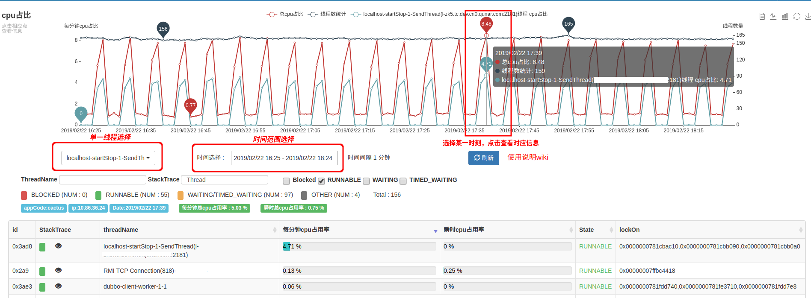
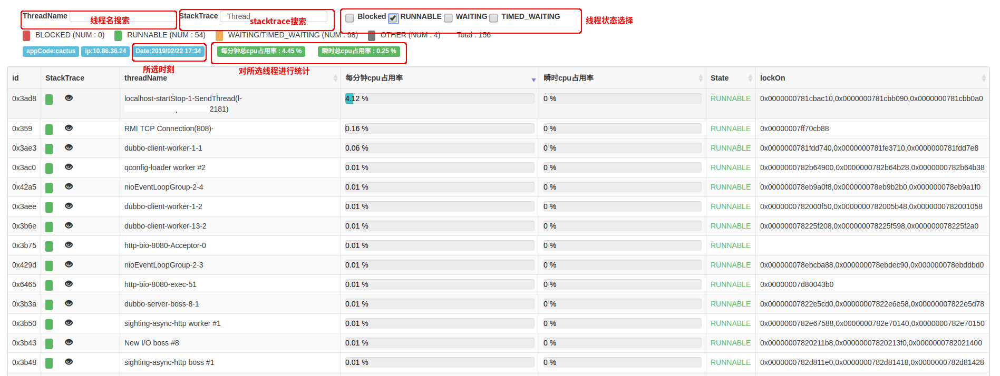

# 线程级cpu监控

在故障定位和性能分析的时候，thread dump能有效的帮助我们定位代码问题，线程级cpu监控可以查看最近三天内每分钟的各个线程的每分钟cpu占用率、瞬时cpu占用率、状态及调用堆栈等信息，通过对历史线程信息分析，可以得到应用是否“卡”在某一点上，即在某一点运行的时间太长，如数据库查询，长期得不到响应，最终导致系统崩溃。

## 实现
为了支持历史查询，bistoury会在agent上启动一个定时任务，每分钟获取一次线程信息，然后将线程信息存放到rokcsDB。

bistoury会先attach到jvm获取线程的线程Id、线程名、线程状态等信息，然后从/proc/pid/task/nid/stat下读取每个线程的cpu信息

## 使用
- 进入主机信息页面
- 选择需要查看的应用、机器
- 点击 【jstack输出】

线程级cup监控主要分为两个区域，区域一是线程数量和cpu占比的折线图，区域二是线程完整信息。

### 区域一

可以单独查看某一线程的cpu占比，也可以查看不同时间的cpu占比（支持最近三天），点击某一时间对应的点，可以在区域二展示具体的线程信息。

### 区域二

可以按照线程名、线程调用栈、线程状态对线程进行筛选，其中每分钟cpu占用率是该分钟内cpu使用占比，瞬时cpu使用占比，是指抓取数据时cpu瞬时cpu使用率占比。

stacktrace按钮展示

