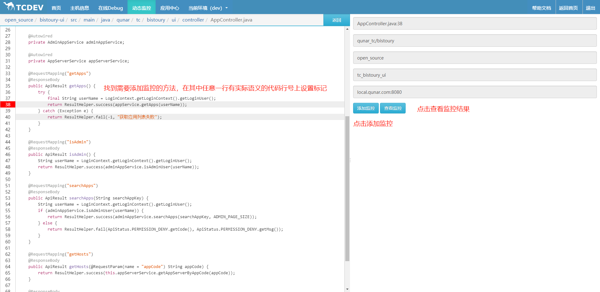

# 动态监控使用说明

监控在排查问题、监控应用运行状态中起着重要作用，但是一般情况下监控系统的使用都需要在开发过程中在代码中设置置埋点，当需要新增监控来监控一个方法的执行时间时，需要修改代码后重新发布，整个过程较繁琐。
动态监控旨在减少开发人员的工作量，动态监控不需要修改代码，也不需要停止应用运行，由agent动态添加监控指标。
监控数据每分钟会采集一次并存储在主机上，查询时根据查询区间长度不同，会将数据进行采样处理，多分钟的数据会使用平均的方式进行处理，及当采样间隔位5分钟时，则将从某一时间点开始的5分钟内的数据进行求均值作为这个时间点的数据。
动态监控会监控一个方法的执行时间、调用次数及异常次数。

**注意：** 监控会使用部分应用程序内存，建议内存较小的应用不要添加过多的监控。

## 监控生命周期

动态监控添加的指标生命周期与应用的的生命周期基本一致，从添加开始一直到应用停止，监控回一直采集监控数据。并存储最近三天的历史数据。

## 使用步骤

- 进入动态监控页面，初次使用时请先点击下方链接设置gitlab private token，目前仅支持gitlab，点击输入框下方对应链接获取，然后点击保存设置private token。
。
- 选择需要添加监控的应用名，再选择需要在哪台机器上添加监控，然后点击【选择】按钮，进入文件树。

- 找到需要添加监控的类（注：仅支持Java代码添加监控），点击进入监控页面。
- 找到需要添加监控的方法，在其中任意语句添加标记，点击前方的行号标记所在行。

- 在监控首页可以选择应用及机器后可以查看监控数据

