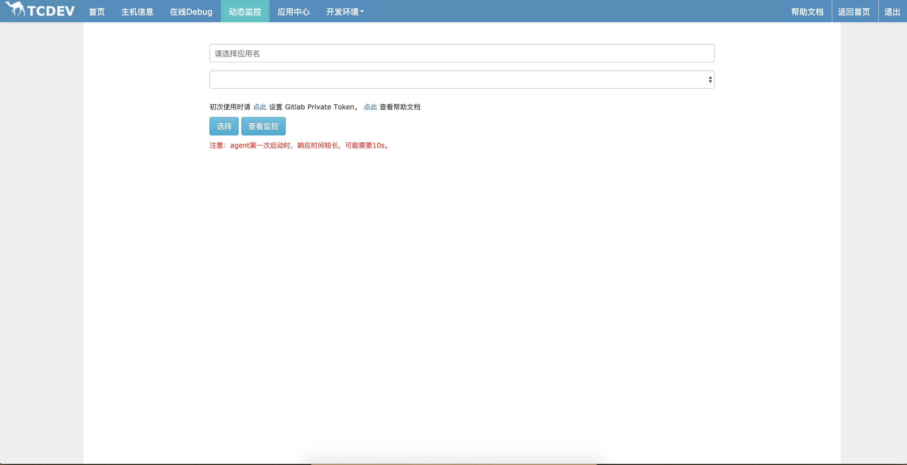
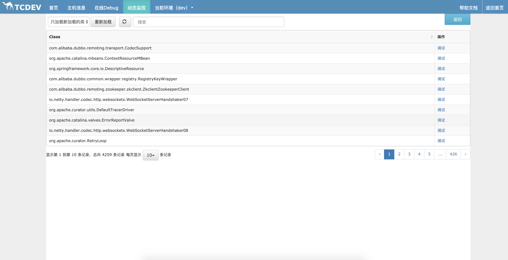
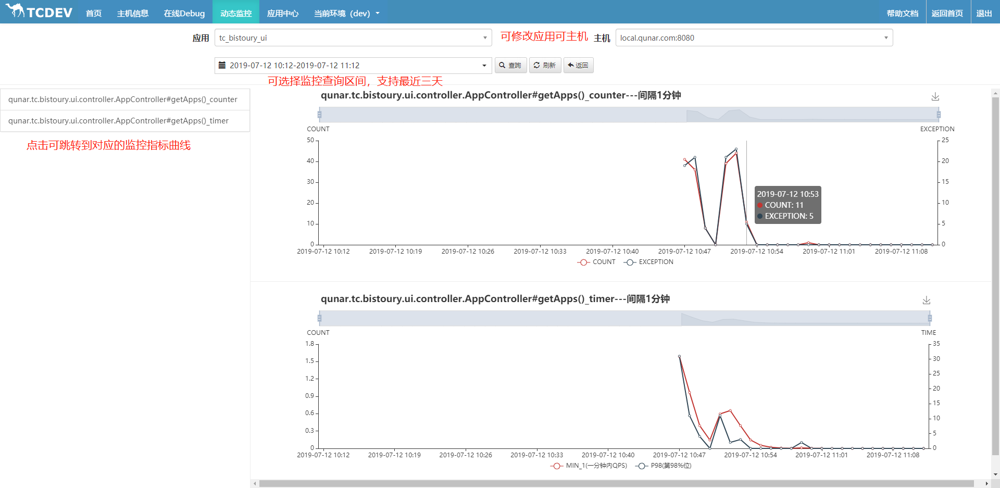

# 动态监控

有时候我们需要对系统的某个方法添加一个监控看看系统运行情况，但经历一次修改代码、qa检查、重新发布的流程又感觉不划算，这就是动态监控大显身手的时候了。
动态监控类似于Arthas的monitor方法，会对方法的执行时间、调用次数、失败次数进行监控，不同之处在于会生成对应的监控图，保留最近几天的数据，并且提供了web界面，通过类似添加断点的方式来添加监控。

**注意：** 监控会使用部分应用程序内存，建议内存较小的应用不要添加过多的动态监控。

## 监控生命周期

动态监控添加的指标生命周期与应用的的生命周期基本一致，从添加开始一直到应用停止，监控回一直采集监控数据。并存储最近三天的历史数据。

## 使用

- 进入动态监控页面，初次使用时请先点击下方链接设置gitlab private token，若不设置，则添加断点时的代码将会通过反编译产生。目前仅支持gitlab，点击输入框下方对应链接获取，然后点击保存设置private token。

- 选择需要添加监控的应用名，再选择需要在哪台机器上添加监控，然后点击【选择】按钮。

- 进入已加载类列表。

- 找到需要添加监控的类（注：仅支持Java代码添加监控），点击进入监控页面。
- 找到需要添加监控的方法，在其中任意语句添加标记，点击前方的行号标记所在行。

- 在监控首页可以选择应用及机器后可以查看监控数据

